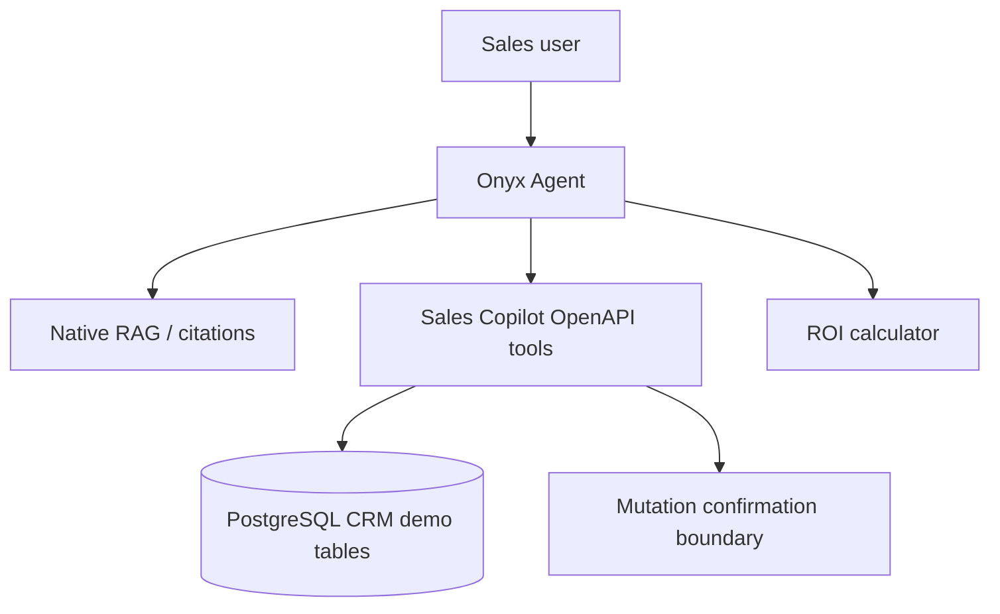

# Enterprise AI Sales Copilot

一个基于 Onyx Community Edition 的二次开发 PoC，面向 ToB 销售、售前与 FDE。它把 Onyx 原生 RAG 和 Agent Tool Calling 连接到一套可复现的销售 CRM 演示数据。

## Why Onyx

Onyx 原生提供聊天、Agent、RAG、文档索引、引用、权限、Tool Runner 和可配置的 OpenAPI/MCP Actions。本项目只增加销售领域的类型安全 API、CRM 数据、写操作确认边界和 ROI 计算；不重写 RAG 或 Agent loop。

## Features

- Accounts, contacts, opportunities, products, activities and follow-up tasks.
- Read endpoints for account, opportunity, activity and pipeline analysis.
- Write endpoints guarded by an explicit `confirmed` field for tasks and opportunity stages.
- Transparent ROI calculation.
- Demo knowledge files in `docs/sales_copilot_knowledge/`, ingested through the normal Onyx document flow.

## Setup

1. Follow the root `CONTRIBUTING.md` prerequisites: Python 3.13, uv, Docker and Bun.
2. Start standard Onyx services, then run `uv run alembic upgrade head` from `backend/`.
3. Run `uv run python backend/scripts/seed_sales_copilot_demo.py` from the repository root.
4. Configure an Onyx Custom Action using the server OpenAPI schema and attach it, plus Onyx Search, to a “Sales Copilot” agent. The API prefix is `/sales-copilot`.
5. Ingest the markdown knowledge files through an Onyx file or connector flow. This preserves native retrieval and citations.

For mutating tools, the intended UX is preview followed by user approval before `confirmed=true`. This is an application-level confirmation guard, not an independent HITL approval system: a model that is permitted to call the Action can itself supply `confirmed=true`.

## Demo prompts

1. 我们的企业 Agent 对私有化部署和数据安全提供哪些能力？
2. 当前 Pipeline 中金额最大的三个 AI Agent 商机是什么？
3. 下午要见星海科技，给我准备完整会前 Brief。
4. 星海科技有 3000 名员工，大量内部 IT 和 HR 问题依赖人工处理，给他们设计一个 AI Agent PoC。
5. 为星海科技创建一个下周的 PoC 跟进任务。

## Test status

Live validation completed on 2026-08-25 with the official backend image and standard PostgreSQL, Redis, OpenSearch, MinIO and model-server services. Migration and deterministic seed passed; Persona 1 used Search Tool 1, Custom Action 12 and the indexed knowledge files with a real `deepseek-v4-flash` OpenAI-compatible provider. Five live, manual end-to-end demos passed: native RAG citations, CRM reads, RAG + CRM, ROI calculation, and preview → confirmation flag → PostgreSQL mutation. Separately, the focused automated unit suite passed (`4 passed`). All CRM records are local deterministic demo data, not a production CRM.

The local frontend was served with the repository's documented Bun development command because a production Next.js build exceeded the available Docker Desktop resources. This did not change application source, the Dockerfile, the Compose dependency graph or locked dependencies.
